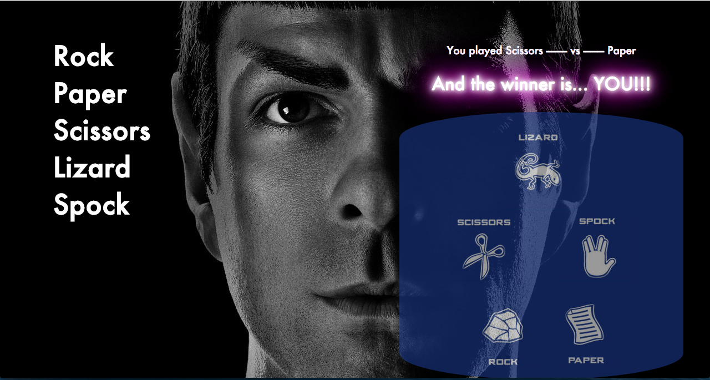

#Rock Paper Sacissors in js

#Objective
Provide a Rock, Paper, Scissors game to be played in the web with the following features:
    - The player has to enter a name to play
    - The player should choose from the presented options(rok, paper and scissors)
    - The game will choose a random option
    - A winner will be declared
Basic Rules
* Rock beats Scissors
* Scissors beats Paper
* Paper beats Rock

#Technologies used
    - Javascript
    - Jasmine
    - CSS/Html
    
#How it works
Clone the repository: ``$ https://github.com/ananogal/rps_js.git``  

###In Tests
Enter the spec directory ``$cd rps_js/spec``
and open the Spec file: ``$ open SpecRunner.html``

###In Code
Check it out here: https://ana-rps-js.herokuapp.com/
